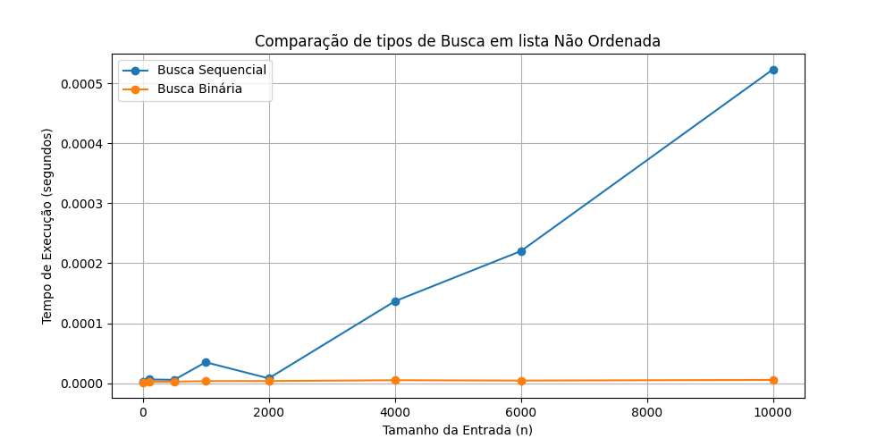
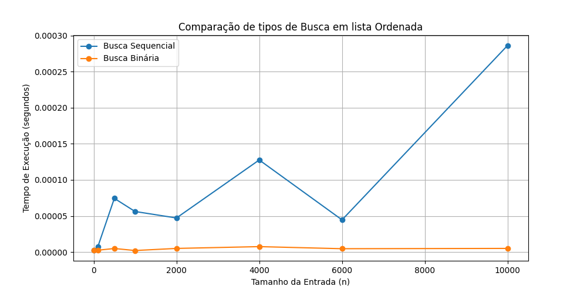

# 📘 Atividade: Implementação e Comparação de Algoritmos de Busca

### Para a criação desse relatório foram utilizadas 3 funções principais em python:

Geração de uma lista com números aleatórios entre valores que variam ate o tamanho da lista.
```
def gerar_lista_aleatoria(tamanho=1000):
    return random.sample(range(0, tamanho + 1), tamanho)
```

Busca Sequencial que retorna o numero de comparações realizadas.
```
def busca_sequencial(lista, alvo):
    comparacoes = 0
    for i, elemento in enumerate(lista):
        comparacoes += 1
        if elemento == alvo:
            return i, comparacoes
    return -1, comparacoes
```

Busca Binária (lista precisa estar ordenada) que retorna o numero de comparações realizadas.
```
def busca_binaria(lista, alvo):
    inicio = 0
    fim = len(lista) - 1
    comparacoes = 0
    while inicio <= fim:
        meio = (inicio + fim) // 2
        comparacoes += 1
        if lista[meio] == alvo:
            return meio, comparacoes
        elif lista[meio] < alvo:
            inicio = meio + 1
        else:
            fim = meio - 1
    return -1, comparacoes
```


## 📈 Relatório de Comparação

### 1. Qual algoritmo teve o melhor desempenho em listas **não ordenadas** e por quê?

A **busca sequencial** é a única que pode ser aplicada em listas não ordenadas. A **busca binária** exige que a lista esteja ordenada, se fosse aplicada em lista não ordenada, poderia gerar erros de execução ou não retornar o elemento procurado.

---

### 2. Qual algoritmo teve o melhor desempenho em listas **ordenadas** e por quê?

Quando a lista está ordenada, a **busca binária** é mais eficiente, com menos comparações e menor tempo de execução, pois cada etapa ela reduz o espaço pela metade
(complexidade **O(log n)**).

---

### 3. Como o aumento do tamanho da lista impacta no tempo de execução?

Buscas m listas menores podem ser feitas com o algoritimo de busca sequencial, pois a diferença de tempo e etapas entre os dois algoritimos é pequena. Além disso, o grau de dificuldade de implementação da busca binária ser maior e existir a dificuldade da lista obrigatoriamente ser ordenada.

---

### 4. Comportamento em listas grandes e pequenas:

**Listas pequenas**: a diferença de desempenho entre os algoritmos é pequena.
**Listas grandes**: a **busca binária** se destaca significativamente, pois  tem um tempo de execução e de etapas quase constante (complexidade **O(log n)**).


## 📈 Gráficos em diferentes tipos de lista





# 🔍 Valores Busca em lista Não Ordenada

- Tamanho da lista: 10
- Alvo para ser encontrado: 9

#### Busca Sequencial
- Índice na lista: 6
- Comparações: 7
- Tempo: 0.00000240 segundos

#### Busca Binária
- Índice na lista: 8
- Comparações: 3
- Tempo: 0.00000170 segundos
------------------------------

- Tamanho da lista: 100
- Alvo para ser encontrado: 12

#### Busca Sequencial
- Índice na lista: 15
- Comparações: 16
- Tempo: 0.00000280 segundos

#### Busca Binária
- Índice na lista: 12
- Comparações: 6
- Tempo: 0.00000240 segundos
------------------------------

- Tamanho da lista: 500
- Alvo para ser encontrado: 275

#### Busca Sequencial
- Índice na lista: 131
- Comparações: 132
- Tempo: 0.00000690 segundos

#### Busca Binária
- Índice na lista: 274
- Comparações: 8
- Tempo: 0.00000300 segundos
------------------------------

- Tamanho da lista: 1000
- Alvo para ser encontrado: 289

#### Busca Sequencial
- Índice na lista: 645
- Comparações: 646
- Tempo: 0.00003370 segundos

#### Busca Binária
- Índice na lista: 289
- Comparações: 9
- Tempo: 0.00000330 segundos
------------------------------

- Tamanho da lista: 2000
- Alvo para ser encontrado: 1910

#### Busca Sequencial
- Índice na lista: 1913
- Comparações: 1914
- Tempo: 0.00009970 segundos

#### Busca Binária
- Índice na lista: 1909
- Comparações: 9
- Tempo: 0.00000340 segundos
------------------------------

- Tamanho da lista: 4000
- Alvo para ser encontrado: 3526

#### Busca Sequencial
- Índice na lista: 3466
- Comparações: 3467
- Tempo: 0.00021320 segundos

#### Busca Binária
- Índice na lista: 3526
- Comparações: 10
- Tempo: 0.00000380 segundos
------------------------------

- Tamanho da lista: 6000
- Alvo para ser encontrado: 1557

#### Busca Sequencial
- Índice na lista: 4926
- Comparações: 4927
- Tempo: 0.00027910 segundos

#### Busca Binária
- Índice na lista: 1557
- Comparações: 12
- Tempo: 0.00000490 segundos
------------------------------

- Tamanho da lista: 10000
- Alvo para ser encontrado: 3302

#### Busca Sequencial
- Índice na lista: 3630
- Comparações: 3631
- Tempo: 0.00020800 segundos

#### Busca Binária
- Índice na lista: 3302
- Comparações: 13
- Tempo: 0.00000490 segundos


# 🔍 Valores Busca em lista Ordenada

- Tamanho da lista: 10
- Alvo para ser encontrado: 7

#### Busca Sequencial
- Índice na lista: 7
- Comparações: 8
- Tempo: 0.00000320 segundos

#### Busca Binária
- Índice na lista: 7
- Comparações: 2
- Tempo: 0.00000170 segundos
------------------------------

- Tamanho da lista: 100
- Alvo para ser encontrado: 19

#### Busca Sequencial
- Índice na lista: 19
- Comparações: 20
- Tempo: 0.00000640 segundos

#### Busca Binária
- Índice na lista: 19
- Comparações: 7
- Tempo: 0.00000390 segundos
------------------------------

- Tamanho da lista: 500
- Alvo para ser encontrado: 188

#### Busca Sequencial
- Índice na lista: 188
- Comparações: 189
- Tempo: 0.00000860 segundos

#### Busca Binária
- Índice na lista: 188
- Comparações: 9
- Tempo: 0.00000240 segundos
------------------------------

- Tamanho da lista: 1000
- Alvo para ser encontrado: 324

#### Busca Sequencial
- Índice na lista: 324
- Comparações: 325
- Tempo: 0.00001500 segundos

#### Busca Binária
- Índice na lista: 324
- Comparações: 9
- Tempo: 0.00000260 segundos
------------------------------

- Tamanho da lista: 2000
- Alvo para ser encontrado: 1173

#### Busca Sequencial
- Índice na lista: 1172
- Comparações: 1173
- Tempo: 0.00006070 segundos

#### Busca Binária
- Índice na lista: 1172
- Comparações: 10
- Tempo: 0.00000360 segundos
------------------------------

- Tamanho da lista: 4000
- Alvo para ser encontrado: 2453

#### Busca Sequencial
- Índice na lista: 2452
- Comparações: 2453
- Tempo: 0.00038280 segundos

#### Busca Binária
- Índice na lista: 2452
- Comparações: 12
- Tempo: 0.00000690 segundos
------------------------------

- Tamanho da lista: 6000
- Alvo para ser encontrado: 5330

#### Busca Sequencial
- Índice na lista: 5329
- Comparações: 5330
- Tempo: 0.00027880 segundos

#### Busca Binária
- Índice na lista: 5329
- Comparações: 13
- Tempo: 0.00000390 segundos
------------------------------

- Tamanho da lista: 10000
- Alvo para ser encontrado: 4268

#### Busca Sequencial
- Índice na lista: 4268
- Comparações: 4269
- Tempo: 0.00021460 segundos

#### Busca Binária
- Í#ndice na lista: 4268
- Comparações: 13
- Tempo: 0.00000380 segundos
------------------------------